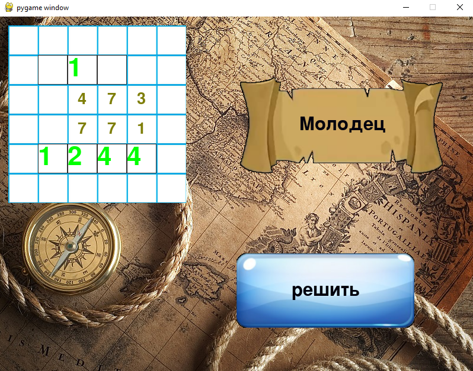

Это маленькая программа для ребенка направленная на то , что бы он учился складывать в столбик. На текущий момент очень
сырая программа. Но цель достигнута. И так. Программа генерирует случайный пример на сложение. В случаи правильного 
решение выводит сообщение “молодец”. Для решения нового примера программу нужно перезапустить.

Как запустить.
1.	установите модуль pygame
      

      pip install pygame
2.	запускаем game_math.py
	  

